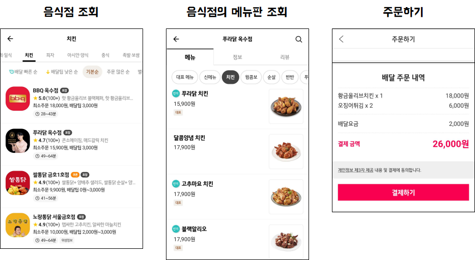
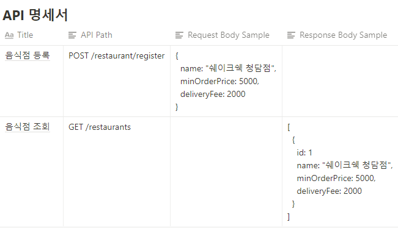
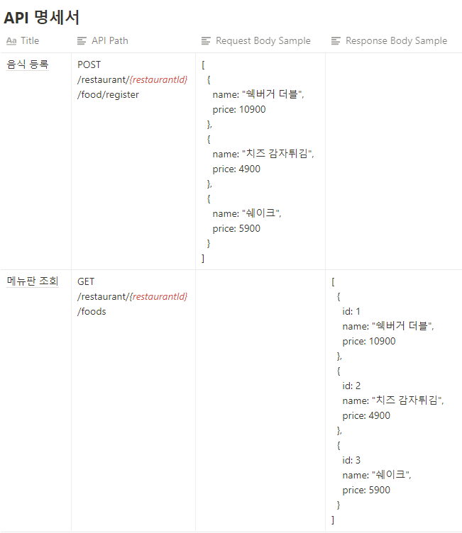
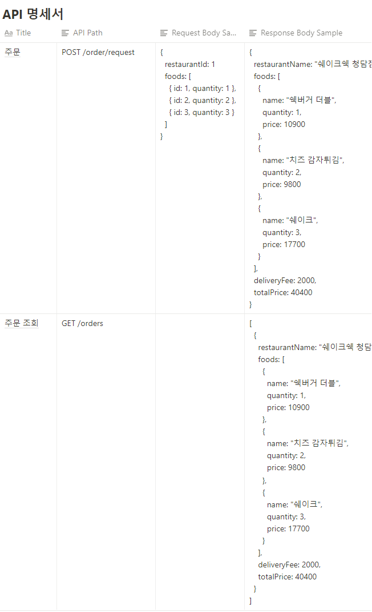
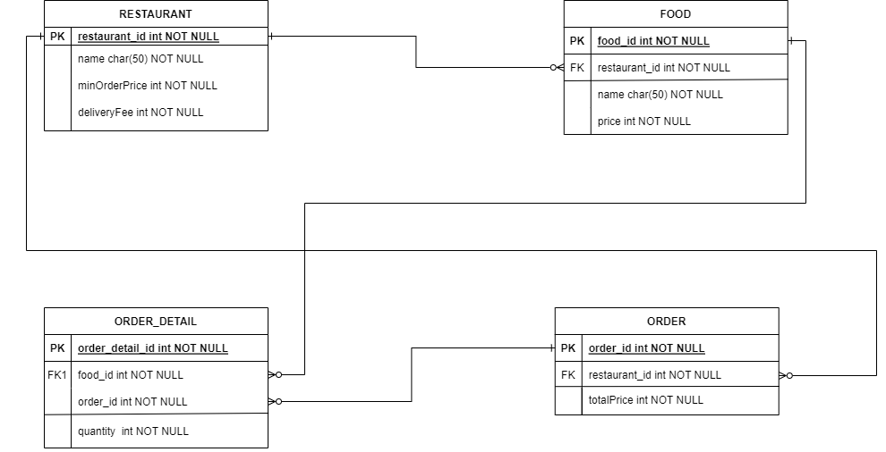

# 항해99 주특기 심화주차 과제

## 개발환경

- JAVA 11
- SpringBoot 2.7.1
- Lombok
- Spring-Web
- Spring-Validation
- JPA
- H2
- MySQL


## 요구사항

- 자세한 안내사항(개인과제링크)
  + https://teamsparta.notion.site/Spring-a53c10d822ba478ea2436664d58f45b8

```
🚩 Requirement:  과제에 요구되는 사항이에요
```

- 배달앱 한 번씩은 사용해 보셨죠? 여러분은 이번 과제를 통해 배달앱의 백엔드 서버 개발자가 되어 배달앱 서버에 필요한 핵심 API 를 구현해 볼 예정입니다.

- `과제 요구 사항`을 모두 완수해야 합니다!

```
✅ 과제 요구 사항
```

- 스프링 서버를 통해  아래 요구사항에 맞춰 배달앱 API 를 구현합니다. 크게 3개의 요구사항으로 나뉘어져 있고, 제공되는 테스트 코드가 모두 성공적으로 작동하게 되면 과제 완료입니다!

```
[요구사항]
  
1. 음식점 등록 및 조회
2. 음식 등록 및 메뉴판 조회
3. 주문하기
```
  
UI 개발 없이 백엔드 서버를 개발해야 하기 때문에, 각 API 에서 제공되는 데이터들이 어떻게 사용될지는 아래 배달앱 샘플 UI 를 참고합니다. 
  
```
🚨 주의! 샘플 UI 는 이해를 돕기 위한 것으로 실제 요구사항과 다를 수 있습니다. 반드시 과제 요구사항 내용에 맞춰 구현 해 주세요.
```


  
1. 음식점 등록 및 조회
    - 음식점 정보 입력받아 등록
        1. 음식점 이름 (name)
        2. 최소주문 가격 (minOrderPrice)
            1. 허용값: 1,000원 ~ 100,000원 입력
            2. 100 원 단위로만 입력 가능 (예. 2,220원 입력 시 에러발생. 2,300원은 입력 가능)
            3. 허용값이 아니거나 100원 단위 입력이 아닌 경우 에러 발생시킴
        3. 기본 배달비 (deliveryFee)
            1. 허용값: 0원 ~ 10,000원 (예. 11,000원 입력 시 에러발생.)
            2. 500 원 단위로만 입력 가능 (예. 2,200원 입력 시 에러발생. 2,500원 입력 가능) 
              
    - 음식점 조회
        - 등록된 모든 음식점 정보 조회 가능
            1. 등록 시 입력한 음식점 정보 (name, minOrderPrice, deliveryFee)
            2. DB 테이블 ID (id)  
    

      
2. 음식 등록 및 메뉴판 조회
    - 음식점 ID 및 음식 정보 입력받아 등록
        1. 음식점 ID (restaurantId)
            1. 음식점 DB 테이블 ID
        2. 음식명 (name)
            1. 같은 음식점 내에서는 음식 이름이 중복될 수 없음 (예. '자담치킨 강남점'에 '후라이드치킨' 이 이미 등록되어 있다면 중복하여 등록할 수 없지만, 다른 음식점인 '맘스터치 강남점'에는 '후라이드치킨' 을 등록 가능)
        3. 가격 (price)
            1. 허용값: 100원 ~ 1,000,000원
            2. 100 원 단위로만 입력 가능 (예. 2,220원 입력 시 에러발생. 2,300원 입력 가능)
            3. 허용값이 아니거나 100원 단위 입력이 아닌 경우 에러 발생시킴
              
    - 메뉴판 조회
        - 하나의 음식점에 등록된 모든 음식 정보 조회
            1. 등록 시 입력한 음식 정보 (name, price)
            2. DB 테이블 ID (id)
              
      

      
3. 주문 요청하기 및 주문 조회
    - 주문 요청 시 배달 음식점 및 음식 정보 입력받음
        1. 음식점 ID (restaurantId)
        2. 음식 주문 정보 (foods)
            1. 음식 ID (id)
            2. 음식을 주문할 수량 (quantity)
                1. 허용값: 1 ~ 100
                2. 허용값이 아니면 에러 발생시킴
                  
    - 주문 요청에 대한 응답으로 다음 정보를 포함시킴
        1. 주문 음식점 이름 (restaurantName)
        2. 주문 음식 정보 (foods)
            - 주문 음식명 (name)
            - 주문 수량 (quantity)
            - 주문 음식의 가격 (price)
                - 계산방법
                    - 주문 음식 1개의 가격 * 주문 수량
        3. 배달비 (deliveryFee)
            - 주문 음식점의 기본 배달비
        4. 최종 결제 금액 (totalPrice)
            - 계산방법
                - 주문 음식 가격들의 총 합 + 배달비
            - "주문 음식 가격들의 총 합" 이 주문 음식점의 "최소주문 가격" 을 넘지 않을 시 에러 발생시킴
              
    - 주문 조회
        - 그동안 성공한 모든 주문 요청을 조회 가능
      



## DB 모델링
